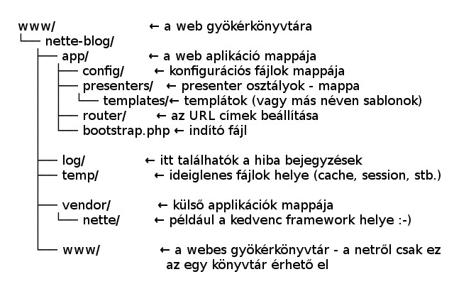
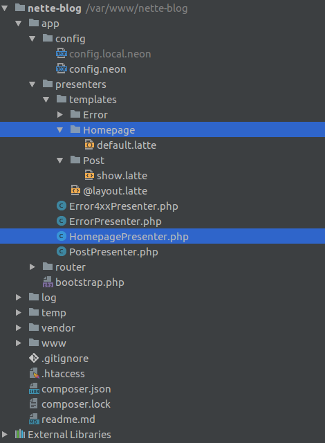

	 	 	
# Nette Framework Quickstart - első applikációm - Nette Web Project
## A hivatalos dokumentáció fordítása cseh nyelvről, kezdőbarát megjegyzésekkel kiegészítve és senior fejlesztők által lektorálva (nagyon nagy köszi mindenkinek :) )

### 1. Első lépések (en: Getting started)

* A legelső teendő indulás előtt egy gyors ellenőrzés, hogy a használt szerverünk teljesíti-e a Nette Framework futtatásához szükséges feltételeket (minimum 5.6.0-s PHP, a teljes feltételrendszer itt található: [Nette Requirements](https://doc.nette.org/en/2.4/requirements). Valószínűleg minden rendben lesz vele, de a biztonság kedvéért ellenőrizzük le, megéri. A tutorial Apache 2.4-re készült.
* A Nette Framework letöltéséhez a hivatalosan javasolt és ajánlott letöltési módszer a Composerrel való letöltés https://doc.nette.org/en/2.4/composer. Ha még nem találkoztunk a Composerrel, szánjunk rá pár percet, hogy megismerjük használatát. A Composer egy kifejezetten egyszerű és hasznos eszköz, ez a legelterjedtebb külső függőségeket kezelő program PHP-ra (PHP dependency manager). Mindent szükséges infót megtalálunk róla a [dokumentációjában]( https://getcomposer.org/doc/). Ha a Composer dokumentációja alapján installáltuk a Composert a gépünkre, akkor: 

(TimVass: kezdők inkább a globális installációt válasszák, ha nem tudják mi a különbség a globális és a lokális installálás közt)

1. Megkeressük a webszerverünk helyi gyökérkönyvtárát (pl. /var/www, vagy C:/InetPub is lehet). (TimVass: Ez általában ott van, ahova az apache vagy az nginx webszervert is telepítettük, ha nem tudjuk hol van, akkor keressük ki az interneten. A kereséshez ajánlott kulcsszavak: webserver root directory, document root vagy web root. Bár szerintem egyszerűen csak navigáljunk abba a mappába, ahová a php projektjeinket szoktuk menteni és jók leszünk :) ). 
1. (Timvass: Megnyitjuk a parancssor programot Windowsnál Accesoires->Command Prompt, Mac esetében Terminal ) 
1. (Timvass: Belépünk a parancssorban a gyökérkönyvtárba)
1. Beírjuk a következő utasítást:

	`composer create-project nette/web-project nette-blog`


(TimVass: Ez a parancs azt jelenti, hogy a Composer a saját [Packagist könyvtárából](https://packagist.org/packages/nette/web-project) letölti a nette/web-projectet és azt minden függőségével (dependency) és körülményével együtt bemásolja az általunk megadott nette-blog mappába. Vagy ha nincs még ilyen mappa a gyökérkönyvtárban (pl /var/www vagy C:/InetPub), akkor elkészíti. Igazából bármilyen nevet adhatnánk a projektnek, most nette-blognak nevezzük. )

Ha valami miatt nem tudunk Composert használni, letölthetjük manuálisan is a [githubról a Nette Web Projectet](https://github.com/nette/web-project/archive/preloaded.zip). Ezt letöltés után kicsomagoljuk, bemásoljuk a gyökérkönyvtárunkba és átnevezzük "nette-blog"-ra.* 

(TimVass: Ha szeretnénk egy [parancssor gyorstalpalót](https://lifehacker.com/5633909/who-needs-a-mouse-learn-to-use-the-command-line-for-almost-anything), mert mondjuk nem tudunk belépni a parancssor használatával a gyökérkönyvtárba, akkor keressünk egy tutorialt az interneten. Kulcsszavak: command line basics, getting to know the command line*)

* Ha Unix alapú rendszeren dolgozunk (pl. Mac OS X vagy Linux), akkor módosítanunk kell a webszerver jogait is: engedélyezni kell a temp és a log file-ok írását.

```cd nette-blog && chmod -R a+rw temp log```

*Megjegyzés: egyes Linuxokon (Fedora, CentOs,…) alapból be van kapcsolva a SELinux. Ezért módosítani kell a SELinux policiest, vagy be kell állítani a megfelelő SELinux security context-et a temp és log fájloknak.*


#### 1.1. Főoldal (en: The Welcome Page)

Ha letöltöttük a gépünkre a Nette Quickstartot a fentiek szerint és beírjuk a böngészőnkbe a `http://localhost/nette-blog/www/` címet, és a "Congratulations!" című ablakot látjuk (fotó lejjebb), akkor már jók vagyunk, működik a Nette applikációnk :)


#### 1.2. A Web projekt felépítése (en: Web Project's Content)



* **nette-blog/www** könyvtárunk szolgál majd az összes böngészőkliens számára elérhető fájl mentésére, úgy mint a képek, JavaScript fájlok, stylesheetek, ikonok, fontok és más fájlok elhelyezésére. Csak ez az egy mappa lesz majd nyilvános, úgyhogy a készülő applikációnk gyökérkönyvtárát majd úgy állítjuk be, hogy ide mutasson.(Ezt majd a tutorial egy későbbi szakaszában állítjuk be) (TimVass kiegészítése: Ebben a mappában található az index.php is, amiben csak az az egy parancs van, hogy az összes Nette tartalmat behívja az app/bootstrap.php fájlon keresztül. Ez az egy mappa lesz kívülről bárki számára elérhető.)

* **app/** mappában fogunk az időnk nagy részében dolgozni. Ebben a mappában található a [bootstrap.php] (https://doc.nette.org/en/2.4/bootstrap) fájl, amely elindítja és konfigurálja az applikációt. Aktiválja az [autoloadingot](https://doc.nette.org/en/2.4/robotloader), beállítja a [debugger eszközt](https://tracy.nette.org/en/) és a [routolást](https://doc.nette.org/en/2.4/routing). 

(TimVass: A nyilvánosan elérhető www/index.php a nyilvánosság előtt rejtve levő app/bootstrap php-t hívja be. **A bootstrap.php** az applikációnk indítókulcsa. A bootstrap:	
	* Behívja a **config.neon** és a **config.local.neon** 	beállításokat és azok alapján állítja be az applikációnkat 	(pl. az adatbázis beállításához a jelszónkat is innen veszi) 	
	* Aktiválja a [Robot Loadert](https://doc.nette.org/en/2.4/robotloader), amit autoloadingnak is emlegetnek az eredeti dokumentációban. A Robot Loader miatt a Nettében **nem kell include-ot vagy require-t használni**. Ez az ügyes eszköz a Google robotjaihoz hasonlóan megnézi a megadott mappákat és cache-eli őket. Így nekünk csak be kell állítanunk azt a mappát, ahol megtalálja az applikációnkat és a mappát, ahova mentse a cache-elt adatokat.			
	* A bootstrap.php-ből tölt be a speciális Nette **debuggoló eszköz, a [Tracy](https://tracy.nette.org/cs/)** 	
	* Ez gondoskodik a **cache-elésről** és a **routolást** is ez biztosítja be. A routolást összehasonlíthatjuk egy irodaépületben a liftezéssel. Ha a liftben csak a 6 cég nevét lehet megnyomni, akkor a látogatónak nem kell tudnia, hogy melyik cég melyik emeleten van, csak megvárja amig a lift odaviszi. A példában a lift nyomógombjának a logikája elvisz a céghez, router pedig bebiztosítja az utat az applikáció felépítése (a prezenterek metódusai) és az URL-ek közt. A routolással megadhatunk emberek számára könnyebben emészthető és akár jobb SEO helyezést is jelentő címeket. 		
)

A [router](https://doc.nette.org/en/2.4/routing) a SEO szempontból fontos duplázott URL címek problémáját is automatikusan megoldja helyettünk – ha az adott tartalomra több cím is mutat, a Nette framework az elsőt kiindulónak vagy "kanonikusnak" jelöli, a többit pedig 301-en keresztül irányítja át, ahogy azt a SEO szabályok szerint kell). A kanonizációt a presenter API végzi és automatikusan be van kapcsolva. AJAXNÁL és POST lekérdezésnél nincs átirányítás. Részletek a dokumentáció [router - SEO és kanonizáció](https://doc.nette.org/en/2.4/routing#toc-seo-and-canonicalization) pontjánál*


##### *1.2.1 TimVass: Technikai kiegészítések kezdőknek, nem az eredeti Nette tutorialból 1: mi az a presenter és mi az a view? Gyorstalpaló MVP*

* Hasznos források a témában:
	* https://doc.nette.org/en/2.4/quickstart (ez az eredeti Nette tutorial)
	* https://pla.nette.org/cs/navod-vytvarime-staticky-web 
	* https://towardsdatascience.com/10-common-software-architectural-patterns-in-a-nutshell-a0b47a1e9013
	* http://ik.elte.hu/karunkrol/digitkonyv/2016jegyzet/elte_szt_05.pdf
	* http://www.oreilly.com/programming/free/files/software-architecture-patterns.pdf - 46.oldal

* A Nette egy rétegzett architektúrájú, azon belül pedig MVC/MVP tervezési mintán alapuló PHP web framework. Azok számára lehet érdekes következő lépcsőfok a megismerése, akik: 
	* ismerik a PHP-t,
	* ismerik az objektum orientált programozás lényegét.

#### Rövid rátekintés a szoftveres architektúra mintákra, a rétegzett architektúrákra, az MVC és MVP tervezési mintákra:

**Szoftver architektúra minták** (forrás: http://www.oreilly.com/programming/free/files/software-architecture-patterns.pdf - 46.oldal):A következő táblázatban és a hozzá tartozó leírásban láthatunk néhány szót a megfelelő szoftver architektúra minta választásról. Minden applikációhoz más-más szoftver architektúra lehet alkalmas. 

**Rétegzett szoftver architektúrák** (a következő h§rom bekezdés forrása a megjellölt [ELTE jegyzet](http://ik.elte.hu/karunkrol/digitkonyv/2016jegyzet/elte_szt_05.pdf) ): 

A legegyszerűbb szoftver architektúra a monolitikus architektúra. Ez a gyakorlatban a legegyszerűbben úgy tudjuk elképzelni, hogy olyan mint egy spagetti kód, ahol egy home.php file-ban van a teljes “Home” oldal html-je és php-ja is. 

Ennél szofisztikáltabb a kétrétegű architektúra. Összetettebb alkalmazásoknál a kétrétegű architektúra jobb, mint az egyrétegű. Jobban áttekinthető, ha a html és a php el van választva, könnyebben módosítható és újra felhasználható. Így sokkal egyszerűbb egy komponenst, például kérdőívet kivágni és behelyezni egy másik weboldalba. Egy ilyen modell-nézet architektúrában a modell tartalmazza az alkalmazáslogikát (amit üzleti logikának is neveznek) és dolgozik az adatokkal. A nézet tartalmazza a webapplikációnál azt, amit a felhasználó a monitoron lát. Tehát pl. a html-t, css-t javascriptet.

Még kidolgozottabb architektúra az MVC, amely a webfejlesztésben egy igen gyakran használt tervezési minta. Ezt használják a nagyobb webes frameworkok, a Django (egészen pontosan ez a Python framework Model-Template-Viewt, de ez nagyon hasonlít hozzá), a Ruby on Rails és az Angular is.

Tehát junior szavakkal a lényeg, hogy a **Nette egy MVP framework. Az MVP a model, view és presenter szavak rövidítése.** A Quickstart tutorial elején csak presenterrel és view-vel fogunk dolgozni, a tutorial vége felé már modelünk is lesz. **A view a front-end réteg. A model réteg tárolja az üzleti logikát és az kommunikál majd az adatbázissal. A presenterben pedig minden más lesz, elsősorban a front-end rétegünk működéséhez tartozó logika.** Hogy mi a különbség az MVC és az MVP modellek Presentere és Controllere közt? Maga David Grudl a Nette vezető fejlesztője és atyja is csak annyit szokott mondani az előadásain, hogy “hasonló a kettő”. 


##### *1.2.2 TimVass: Technikai kiegészítések  kezdőknek, nem az eredeti Nette tutorialból 2: milyen automatizációs logikával hívja be a presenter a hozzá tartozó view-t?*



A tutorial folytatása előtt röviden kitérek arra is, hogy milyen logika mentén hívja be a presenter a hozzá tartozó View-t.

**Az app/presenters mappába mentjük a presentereket.** Az első két presenter, amit majd elkészítünk a tutorial következő, 3. pontjában, a HomepagePresenter és PostPresenter lesz. A presenterek általános elnevezése “AkármiPresenter”. A presenterek az objektum orientált programozásban megismert osztályok, ezért kezdődik a nevük nagy kezdőbetűvel.

A továbbiakban a view-ket template-nek vagy latte fájloknak is fogjuk nevezni (Ezt tisztázzuk, hogy ne vesszünk el a szakkifejezések rengetegében mindjárt a legelején)

**Minden presenter automatikusan az alap template-et hívja be, ami a @layout.latte.** Ebbe tesszük a html doctype meghatározást, a head-et a css-szel, a html bodyban a headert (fejléc) és a footert (lábléc) és ezen kívül a minden egyes oldalon ismétlődő egyéb front-end elemeket is ide tesszük be. **Majd ebbe az általános template-be a presenter behívja a speciálisan csak hozzá tartozó template-et is.** Szóval az app/presenters/ HomepagePresenterhez tartozó egyedi latte fájlt a **RobotLoader** a presenters/templates/Homepage mappában fogja keresni. Hogy milyen nevű latte fájlt fog keresni a mappában, azt az adott presenterben a metódus neve adja meg. Ha a HomepagePresenter.php presenteremben egy renderDefault nevű metódust írok, akkor a RobotLoader a default nevű lattet fogja előkeresni. Ha renderShow nevű a metódusom, akkor pedig a show.lattet keres ki hozzá.
	
* **Első körben értsük meg a mappa struktúrát: az AkarmiPresenter és a hozzá tartozó Lattek helye:**
	* app/presenters/AkarmiPresenter.php és az 
	* app/presenters/templates/@layout.latte és az 
	* app/presenters/templates/Akármi/….latte -t.

* **Második körben értsük meg a teljes elnevezést és figyeljük meg a metódust is**, az AkarmiPresenterben lévő renderBármi() metódushoz a Nette által automatikusan behívott sablonok és a presenter a következő:
	* app/presenters/AkarmiPresenter.php -ban lévő “public function renderBarmi()” behívja először az 	
	* app/presenters/templates/@layout.latte-t és ezután az 
	* app/presenters/templates/Akármi/barmi.latte -t.


#### 1.3. Tiszta lap (en: Cleanup)

A Web Project már tartalmaz egy előkészített kezdőoldalat. Ennek tartalmát töröljük ki még azelőtt, hogy bármit is programozni kezdenénk. Ezután az `app/presenters/templates/Homepage/default.latte` -ba írjuk be a "Hello World" feliratot.

[Nette kezdőoldal Hello World felirattal](https://files.nette.org/git/doc-2.4/quick-hello.png)


#### 1.4. Tracy a Nette debugger (en: Tracy debugger)

A fejlesztésnél elengedhetetlenül fontos társunk lesz a[ Tracy](https://tracy.nette.org/en/). A Tracy segít mielőbb megtalálni és kijavítani a hibákat, logolja azokat, társunk lesz a változók kiiratásában (dump), méri az időt és a memóriaszükségletet. A Tracy a piacon található php diagnosztikához használt eszközök közt az élen jár. AJAX lekérdezések, XML-ek és képek esetében a FireLoggerrel tudjuk majd használni. Bővebben a Tracyről a dokumentáció[ Tracy](https://tracy.nette.org/en/) részében tudunk olvasni.
